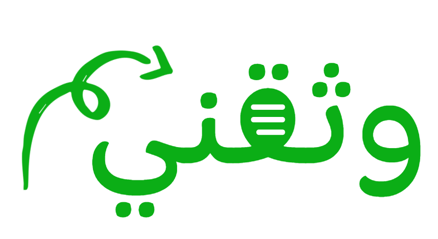

# وثقني  || wathqny

<h2>السلام عليكم</h2>

 بسم الله و الصلاة و السلام علي رسول الله و الّه وصحبه ومن والاه اما بعد ,

**وثقني** ( document me ), دائماً أرى على اليوتيوب المبرمجين يشرحون الأساسيات ثم يأتي شخص آخر ويشرح الأساسيات وهكذا لكن الشرح التطبيقي أو التطبيق العملي مظلوم, يأتي الشخص لديه علم في مجال ما يصعب عليه صنع فديوهات من حيث التصوير أو الصوت أو إعادة التسجيل أو المساحة أو الانترنت او صعوبة الاستمرار بسبب كل هذه المشاكل مجتمعة, لهذا فكرت في صنع ترجمة لأحد المستندات الأجنبية يعني شرح الأساسيات فيها حيث يجتمع الناس الذين يريدون الشرح بدلاً من كل شخص منهم يعلم من الصفر ولا يكمل بل يكرسون جهدهم في عمل واحد ذي جودة عالية نشرح التقنية node js مثلًا حيث يتم شرح المفهوم العام للتقنية ثم شرحها بالكامل في صفحة أخرى  ( API reference ) ونشرح نبذة عن مكتبة ما أو اطار عمل ما لهذه التقنية من باب المعرفة

<h3>الاهداف</h3>

 - التعلم
  >   ليس من الضروري اتقان التقنية للشرح بالتعلمها و اشرحها ترجمها باللغة القرآن

 - نفع الناس
  > قال رسول الله صلي الله عليه و سلم  خيرُ الناسِ أنفعُهم للناسِ 

 - اثراء المحتوي العربي 
  > لما لا يكون هناك شركات كبرى عربية  ( manga ) مطور عربي شرح عربي شركة عربية 